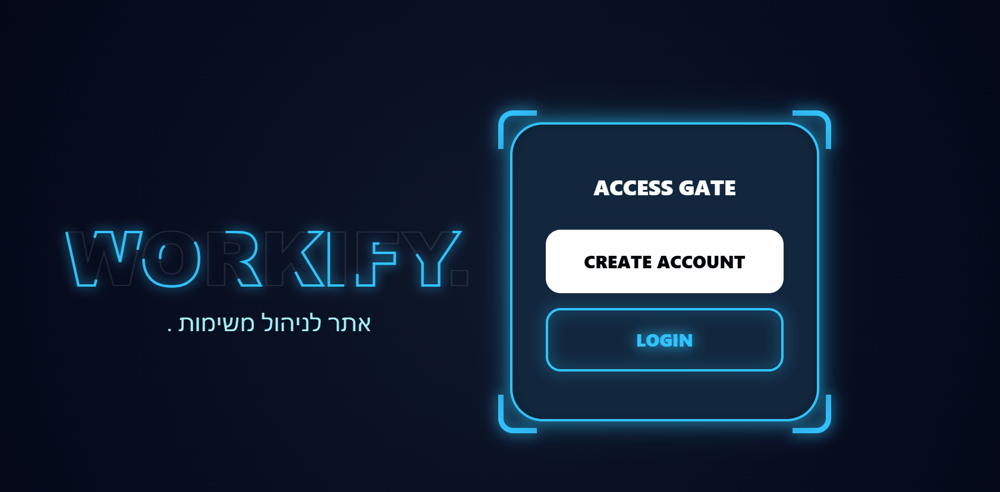

# Staff Management System 🚀

A comprehensive task management system designed to streamline workflows, track employee assignments, and improve team productivity.

## 🎬 Demo


## ✨ Features
* **Task Tracking:** Create, assign, and monitor status of various tasks.
* **Employee Management:** Maintain a clear record of staff members and their responsibilities.
* **Dashboard:** At-a-glance view of pending vs. completed missions.
* **User-Friendly Interface:** Built with efficiency in mind for quick updates.

## 🛠 Tech Stack
* **Language:** Python
* **Backend Framework:** Django
* **Database:** SQLite

## 🚀 Getting Started

### Prerequisites
Make sure you have Python installed on your machine.
```bash
python --version

#Installation
git clone https://github.com/Sara-gitCount/Staff-Management-System.git
#Navigate to the project folder:
cd Staff-Management-System

#Install dependencies:
pip install -r requirements.txt

#Running the App
python main.py
